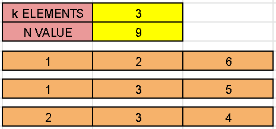

# David_Portfolio
Software developer portfolio

# [Project 1: Sudoku Solver](https://github.com/foleydavid/sudokuSolver)
Play and solve sudokus using backtracking.  When playing, have all the options a great Sudoku app should have: enter numbers, enter notes, change your highlight preferences, and even view past high scores for each difficulty.  You may also command the program to re-update its Sudoku database if you should ever wish it.  When solving, program will scan board for the next blank space and try a value (1 - 9) before assessing if the digit is allowed.  It will move on until a space cannot be solved with any digit, in which case the program will work backwards to adjust the board.

# [Project 2: Asteroid Hunter](https://github.com/foleydavid/AsteroidHunter)
Play as a galatic traveler traversing through outer space.  A host of asteroids fly towards you!  You must dodge asteroids and fill up your ammunition to destroy the asteroids with lasers until all asteroids are destroyed, but be careful as the asteroids will speed up the longer they are left unattended!

# [Project 3: Most Gold](https://github.com/foleydavid/mostGold)
What is the most gold you can acquire traversing through various paths on a grid, if you cannot turn back and cannot step into a value of zero?

In a gold mine grid of size m * n, each cell in this mine has an integer representing the amount of gold in that cell, 0 if it is empty.

Return the maximum amount of gold you can collect under the conditions:

Every time you are located in a cell you will collect all the gold in that cell. From your position you can walk one step to the left, right, up or down. You can't visit the same cell more than once. Never visit a cell with 0 gold. You can start and stop collecting gold from any position in the grid that has some gold.

# [Project 4: String Equation Solver](https://github.com/foleydavid/solveEquation)
Solve a given equation and return the value of x in the form of string "x=#value". The equation contains only '+', '-' operation, the variable x and its coefficient.

If there is no solution for the equation, return "No solution".

If there are infinite solutions for the equation, return "Infinite solutions".

If there is exactly one solution for the equation, we ensure that the value of x is an integer.

# [Project 5: Combination Sum](https://github.com/foleydavid/combinationSum3)
Find all valid combinations of k numbers that sum up to n such that the following conditions are true:

Only numbers 1 through 9 are used. Each number is used at most once. Return a list of all possible valid combinations. The list must not contain the same combination twice, and the combinations may be returned in any order.

# [Project 6: String Calculator with Parentheses](https://github.com/foleydavid/BasicStringCalculator)
Implement a basic calculator to evaluate a simple expression string.

The expression string may contain open ( and closing parentheses ), the plus + or minus sign -, non-negative integers and empty spaces.
Solve each section within open and closing parentheses first.

# [Project 7: Integer to Words](https://github.com/foleydavid/IntegerToWords)
Convert a non-negative integer to its english words representation.
Given input is guaranteed to be less than pow(2, 31) - 1.

# [Project 8: Pong Game](https://github.com/foleydavid/Pong)
Play the game, Pong, against a computer controlled player!  Scores are recorded in the top corner until a winner has been decided.  The background screen will tint with the color of the corresponding player who is currently in the lead.

The computer will seek to chase down the ball when the ball is coming toward the computer goal.  The computer has a random chance to pursue the ball or remain idle at any given moment; this was implemented to allow for a difficulty option when playing against the computer.  After the computer defends its goal, it will return to the middle position.

# [Project 9: Hangman Game](https://github.com/foleydavid/hangmanGame)
This game searches through a long text file of random movie titles and selects a secret word.  A user selects letters to guess compose the word, until the word has been discovered or until the remaining strikes descends to zero.

The user will be shown the letters that have already been selected in alphabetical order, and the user will be instructed to chose again if they accidentally select the same letter twice (this will not count as a strike).  The user may also guess the entire word at any point during the game.

# [Project 10: Longest Prefix - Suffix](https://github.com/foleydavid/longestPrefix-Suffix)
A string is called a prefix-suffix if is a non-empty prefix which is also a suffix (excluding itself).

Given a string s. Return the longest happy prefix of s.

Return an empty string if no such prefix exists.

